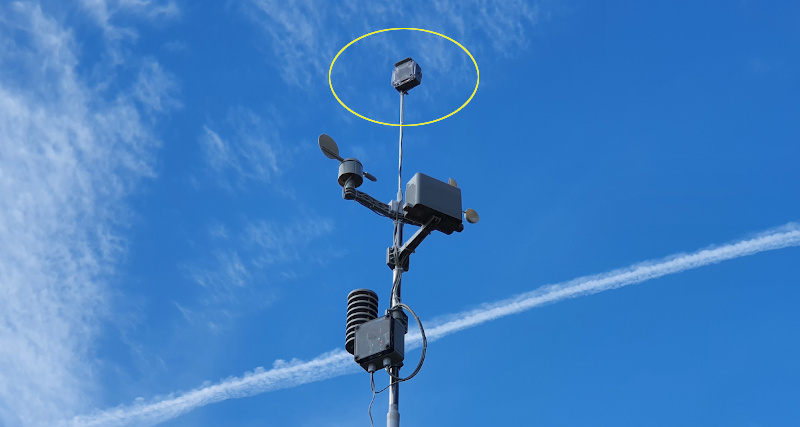
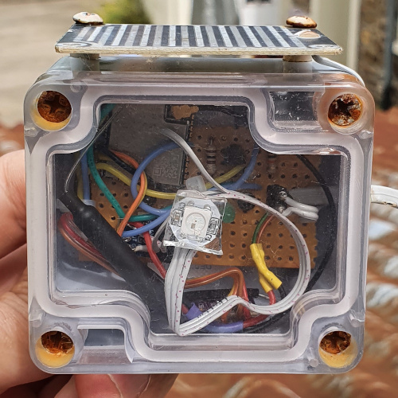
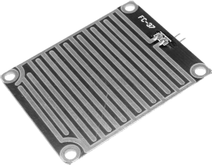
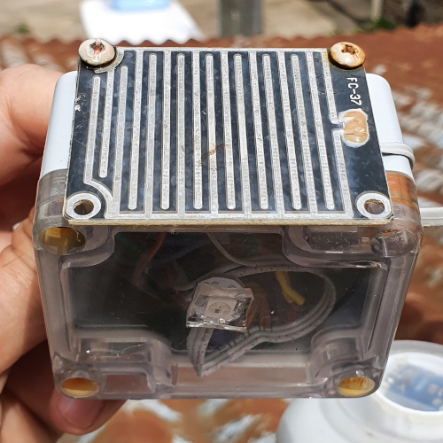

# ESPHome Rain Detector

Read this in other language: [French](README.fr.md)



## Presentation

Following the development of the [ESPHome-based weather station](https://github.com/hugokernel/esphome-weather-station),
I wanted to have a system that would to have a system allowing to detect as soon as possible a rainfall in order to trigger automations in Home Assistant,
especially the one used in conjunction with the roof window opening sensor.

The weather station has a rain sensor but it is a device for measuring rainfall.
It works via the filling of calibrated cup mounted on a balance and the time that a first cup is filled in order to toggle
the device, it has already rained the equivalent of 0.2794mm: it is already too late.

I imagined a lot of things before taking the simplest way: measuring the resistance between 2 conductors separated by a few millimeters
in the hope of detecting a drop of water that would have landed between the 2.

This technique has the merit of being simple but poses some problems, the biggest of which is the corrosion of the conductors, by doing it correctly,
we will be able to limit the this.



## Features

* Adjustable rain detection attempt (default 5 seconds)
* Temperature / relative humidity / air pressure measurement
* RGB status LED based on WS2812
* Low cost
* All functions usable with ESPHome
  * MQTT
  * OTA (Over The Air updates)
  * [The list is long](https://esphome.io/)

As you can see on the introduction picture, the module is installed in a waterproof box (whose screws have completely oxidized despite everything)
attached to the end of a mast hung on the top of the weather station but the device is totally independent and could have been installed somewhere else.

### Installation

In order to install the firmware on the ESP32, I invite you to follow the procedure described on the ESPHome website: [Getting Started with ESPHome](https://esphome.io/guides/getting_started_command_line.html)

### Ideas for improvement

* Put the ESP on standby between 2 measurements

## Explanations

### Rain detection

The sensor used comes from a rain detection kit easily found on line whose photo is below.



The kit has 1 input for the sensor, 1 potentiometer to adjust the threshold, 2 LEDs and 2 outputs: one analog and one digital.

The kit is practical but is not ideal, in addition to working permanently (which will have an impact on the autonomy and oxidation of the tracks), these LEDs and its potentiometer will not serve us for anything,
I preferred to use only the sensor in order to have more control over the measurements via the software.

The idea is therefore to measure at regular intervals the resistance, between each measurement, the voltage applied to the terminals of the tracks of the detection circuit is cut to limit the corrosion of the latter.



Operation:

* By default, when dry, the resistance is very high.
* When the sensor is detected as dry, every 5 seconds (variable `$measure_interval_dry`), a measurement is taken and averaged, if the value + the rain detection threshold (`$rain_detection_threshold`) is lower than the last measurement, then it is considered as rain (or snow).
* If the average sensor resistance minus the dry detection threshold `$dry_detection_threshold` becomes greater than the last value read, then the sensor is considered to be drying.

There are a lot of configuration variables that allow you to configure everything.

Note: For the case of snow, the thresholds may not be the same and it may be possible to distinguish rain from snow

At the level of the ESPHome configuration, the whole is mainly articulated around 3 declarations:

* The declaration of the analog to digital converter
* The `resistance` platform which uses `adc` to make the resistance measurement we are interested in
* And finally, a GPIO switch which is the current source for the measurement

```yaml
sensor:
  - platform: adc
    id: source_sensor
    pin: GPIO33
    name: ADC
    attenuation: 11db
    internal: true

    # It is important to have a low update interval so that
    # the measurement has time to be done correctly during
    # the activation of the voltage AND taking into account the median filter
    update_interval: 250ms

    filters:
      - multiply: 0.846153 # 3.9 (11db attenuation full-scale voltage) -> 3.3V
      - median:
          window_size: 7
          send_every: 4
          send_first_at: 3

  - platform: resistance
    sensor: source_sensor
    id: real_resistance_sensor
    #name: "${friendly_name} resistance"
    configuration: DOWNSTREAM
    resistor: $resistor_value
    reference_voltage: 3.3V
    internal: true
    icon: "mdi:omega"
    filters:
      - lambda: 'return max((float)$min_resistance, x);'
      - lambda: 'return min((float)$max_resistance, x);'
    on_value:
      then:
        - if:
            condition:
              lambda: |-
                  return (
                      id(real_resistance_sensor).state > $min_resistance
                      &&
                      id(real_resistance_sensor).state <= $max_resistance
                  );
            then:
              - sensor.template.publish:
                  id: resistance_sensor
                  state: !lambda "return id(real_resistance_sensor).state;"

switch:
  - platform: gpio
    id: resistance_bias
    name: "${friendly_name} resistance bias"
    icon: "mdi:power"
    pin:
      number: GPIO19
      mode: OUTPUT
```

### Temperature / humidity / air pressure measurement

I used exactly the same configuration as for the [weather station](https://github.com/hugokernel/esphome-weather-station).

These 3 quantities are measured by a Bosch BME280 sensor and its configuration in ESPHome is the following:

```yaml
  - platform: bme280
    address: 0x76
    update_interval: 60s
    iir_filter: 16x
    temperature:
      name: "${friendly_name} temperature"
      oversampling: 16x
    humidity:
      name: "${friendly_name} humidity"
      oversampling: 16x
    pressure:
      name: "${friendly_name} pressure"
      oversampling: 16x
```

### Status LED

An RGB LED type WS2812 is used to inform about the status of the assembly via a `flashing` script.

If you power the assembly via a solar panel or a low power source, you should disable the use of the LED.

```yaml
light:
  - platform: fastled_clockless
    chipset: WS2812
    id: status_light
    name: "${friendly_name} status light"
    pin: GPIO18
    num_leds: 1
    rgb_order: GRB
    restore_mode: ALWAYS_OFF
```

## Files

* raindetector.yaml: The ESPHome configuration file
* network.yaml: Your network information
* secrets.yaml: The secret information about your network.
